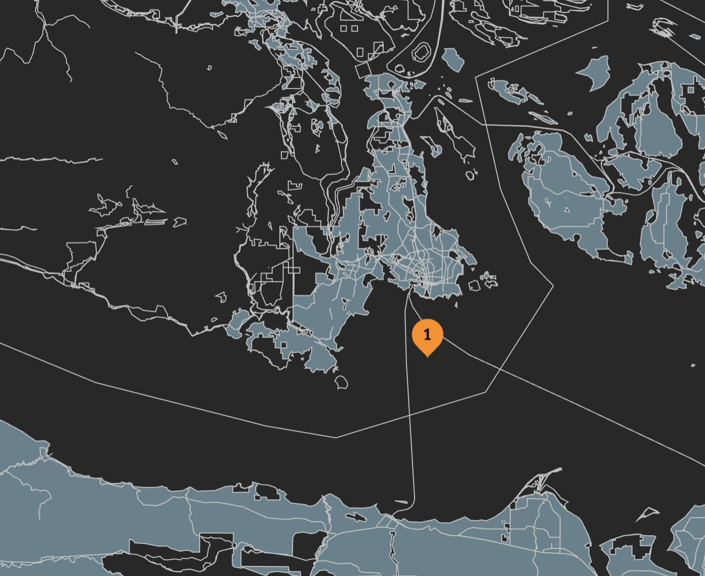
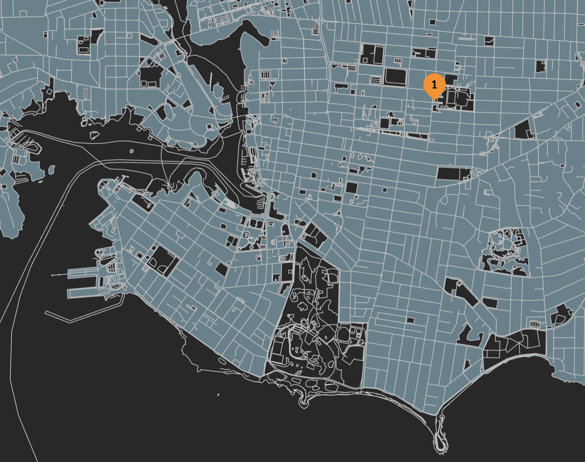

+++
date = '2025-07-16T12:53:00-07:00'
title = 'A tiny search engine using Common Crawl web archives and Stract'
[params]
  author = 'Jim Pick'
+++

Welcome to the new [Hex.Camp](https://hex.camp/) dev blog. I've been posting the occasional update
to my [Bluesky account](https://bsky.app/profile/jimpick.com), but I felt it was
time to set up a formal blog to capture longer updates.

## Quick primer on Hex.Camp

Hex.Camp takes the [H3 geographic indexing system](https://h3geo.org/) from Uber, and maps every hexagon cell from the grid onto a DNS address. By pairing this with [IPFS](https://ipfs.tech/), we can efficiently host millions of websites, each of which is associated with a hexagonal geograhic area on the globe.

For example, this blog is published to a DNS name of **6l22glmvqj2a.vichex.ca**. The `6l22glmvqj2a` portion of the name is actually an encoded H3 location that exists on a map:

In this case, the location was randomly chosen to be nearby Victoria, BC, Canada (where I live). Unintentionally, the location appears to be in the ocean.

Although this blog doesn't need to be associated with a physical location, by placing it on the map, it provides a hint that it should be managed together with other websites nearby. We are using [IPFS Cluster](https://ipfscluster.io/) to maintain a list of all the pinned content in the IPFS cluster. The core idea is to have different IPFS Cluster instances for each community within Hex.Camp. Eventually we will using the "[Collaborative Clusters](https://ipfscluster.io/documentation/collaborative/)" feature to enable data mirroring within a community. 

## Web Archiving on Hex.Camp

Hex.Camp is designed for millions of websites, but it is still very new, multi-user support is a work-in-progress, so it doesn't have much original content apart from a few demos I made, eg. [Photos around Victoria](https://2kgrv5ga2i.vichex.ca/)

We want to discover what use cases it excel at. One clear use case that initially stands out is [web archiving](https://en.wikipedia.org/wiki/Web_archiving) on a community-by-community basis.

We started with [WebRecorder](https://webrecorder.net/), which is just a great project by [Ilya Kreymer](https://bsky.app/profile/ilya.webrecorder.net). I've met him at conferences and I've been watching the project for years. There is [a browser extension](https://webrecorder.net/archivewebpage/) for manually capturing web archive files, plus a [hosted service](https://webrecorder.net/browsertrix/) for scheduling crawls, and even an [open source playback library](https://webrecorder.net/replaywebpage/) that can be embedded into standalone web pages.

To test it out, I captured a WACZ file using [BrowserTrix](https://webrecorder.net/browsertrix/) for the [Compost Education Centre](https://compost.bc.ca/) in Victoria. Because it has a physical location, I can allocate a hexagon/website to hold the data. I used a self-hosted instance of [ReplayWeb.Page](https://webrecorder.net/replaywebpage/) together with the WACZ file on IPFS to make it browseable from the web.

* [https://6kgrvlcuqdaq.vichex.ca/](https://6kgrvlcuqdaq.vichex.ca/)

Here's where `6kgrvlcuqdaq` appears on the map (the same physical location of the building/garden):

In the process of making this, I discovered a small [bug in IPFS](https://github.com/ipfs/kubo/issues/10808) which was quickly fixed. I used to work on the IPFS team, and I know everybody involved, so it was fun to actually find a bug!

## Open Source Search Engines

If we archive a lot of local websites, they could be available for posterity (if we have enough disk space for it). Sort of like a hyperlocal [Wayback Machine](https://web.archive.org/).

I started to wonder if it would be possible to make a search engine with the same data. That would be super useful. Google search is completely dominant, but they've enshittified the results with ads and AI, and it's a US-based goliath with a surveillance capitalism business model. There must be open source alternatives, right?

I did some [research](https://6kgruqaeaaaa.vichex.ca/) and I came up with a short list of 4 projects that seemed active:

* [YaCy](https://yacy.net/)

  Seems to be the oldest project with a small community, written in Java, designed to be peer-to-peer. There's also a more recent rewrite called [YaCy Grid](https://community.searchlab.eu/t/the-story-of-yacy-grid/48) but there was less information about it.

* [Mwmbl](https://mwmbl.org/)

  A new project that has a lot of recent activity. Written in Python.

* [Marginalia](https://marginalia-search.com/)

  Another active project, written in Java.

* [Stract](https://stract.com/)

  Another recent project, written in Rust. Open source development appears to have been [paused](https://github.com/StractOrg/stract/commits/main/) since December, 2024, but they appear to have [plans for the future](https://stract.com/about).

I decided to try out Stract, since I've done a few small Rust projects lately, and the [architecture docs](https://github.com/StractOrg/stract/tree/main/docs/architecture) made me think it was pretty clean. It uses the [Tantivy](https://github.com/quickwit-oss/tantivy/) search library, which is similar to Lucene, but written in Rust.

## Web archive data from Common Crawl

Another reason I decided to try out Stract was that they originally used WARC files from the [Common Crawl project](https://commoncrawl.org/). They have their own crawler now, but I wanted to use my own WARC files (the WACZ files from WebRecorder are just Zip files with WARC files inside).

