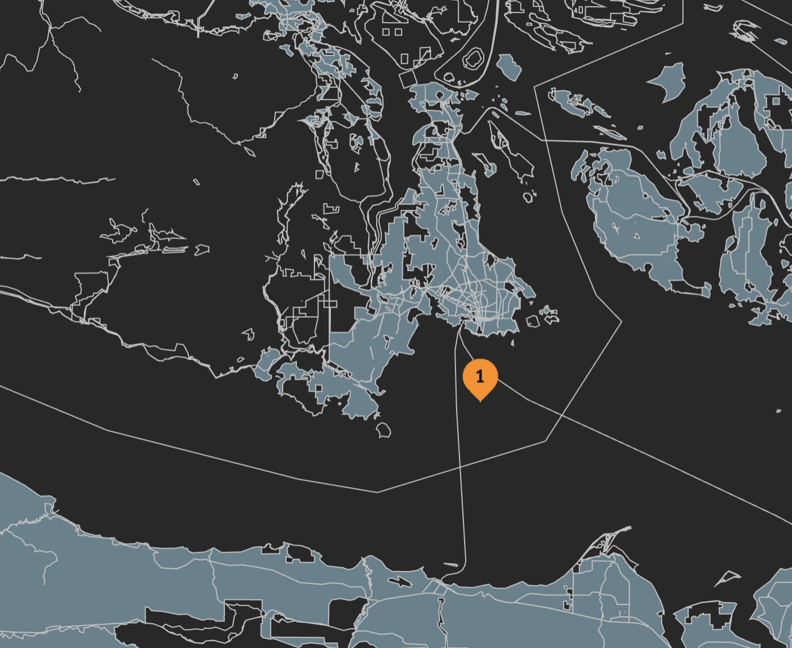
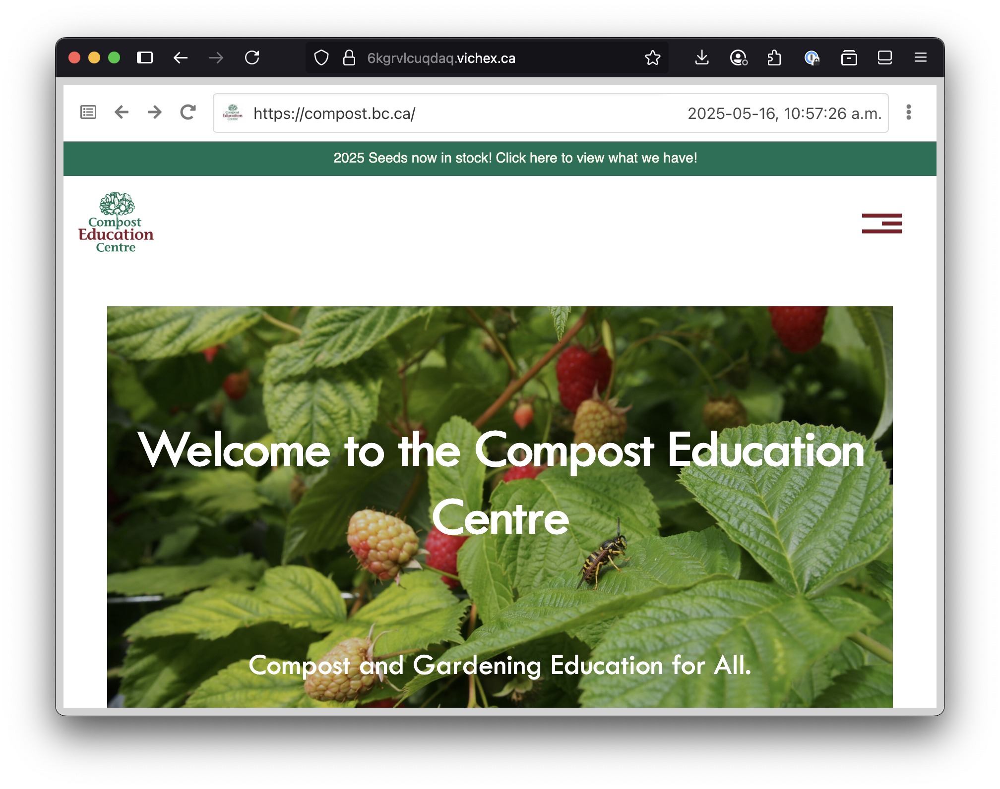
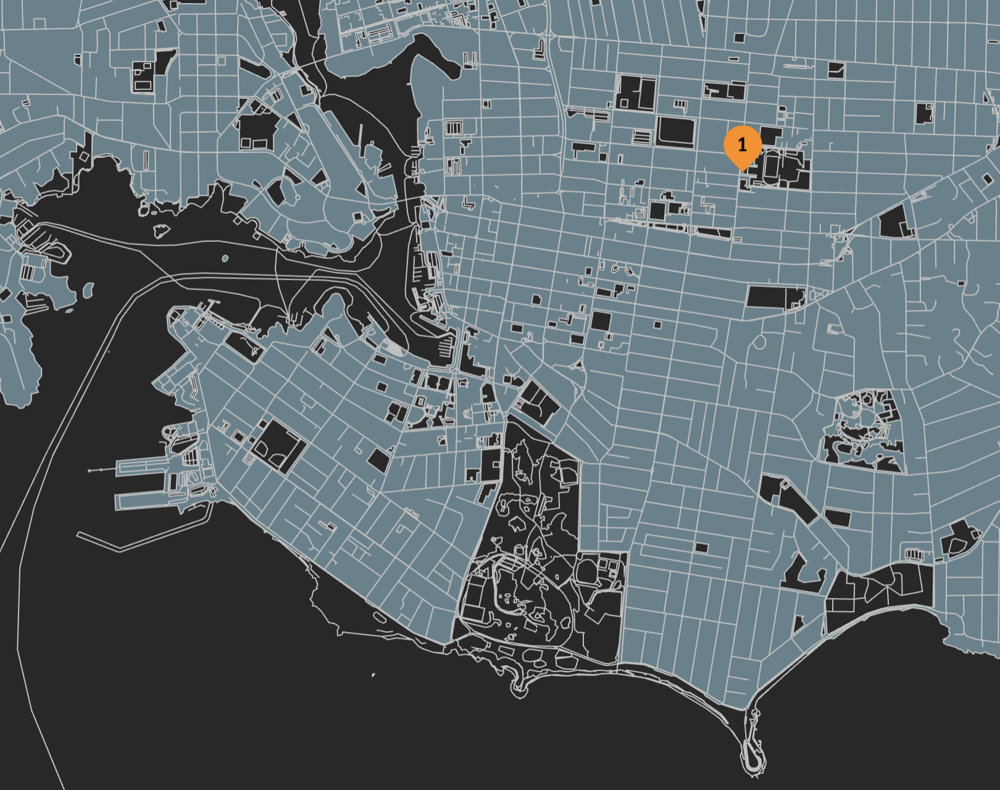
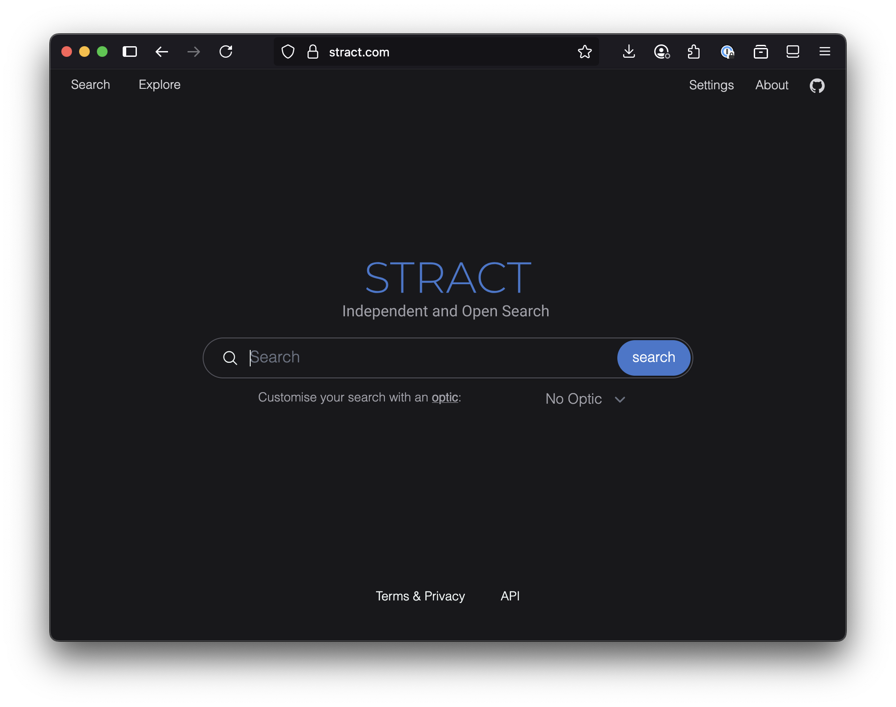
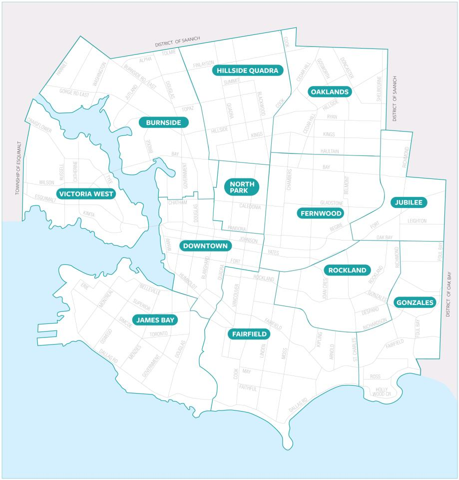
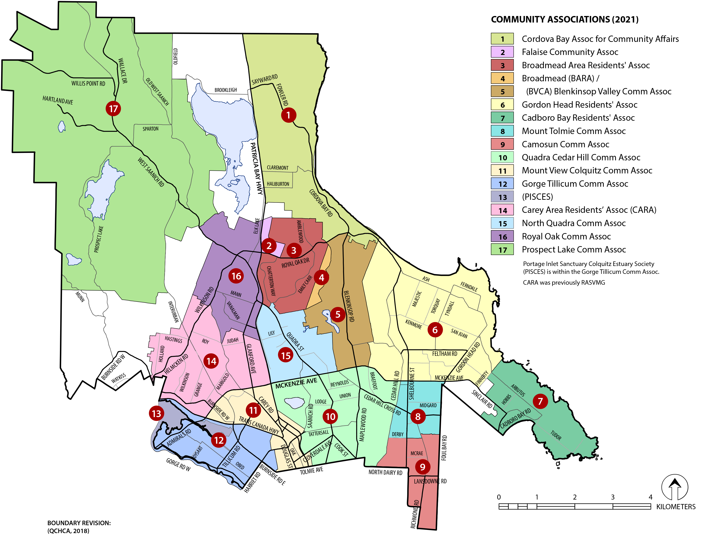
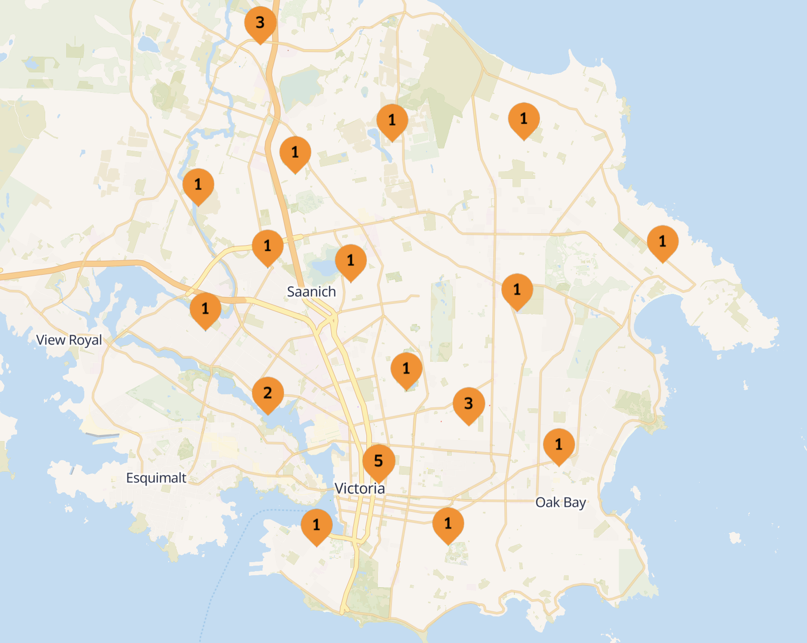

+++
date = '2025-07-16T12:53:00-07:00'
title = 'Making a custom search engine using Common Crawl web archives and Stract'
[params]
  author = 'Jim Pick'
+++

Welcome to the new [Hex.Camp](https://hex.camp/) dev blog. I've been posting the occasional update
to my [Bluesky account](https://bsky.app/profile/jimpick.com), but I felt it was
time to set up a formal blog to capture longer updates.

## Quick primer on Hex.Camp

Hex.Camp takes the [H3 geographic indexing system](https://h3geo.org/) from Uber, and maps every hexagon cell from the grid onto a DNS address. By pairing this with [IPFS](https://ipfs.tech/), we can efficiently host millions of websites, each of which is associated with a hexagonal geographic area on the globe.

For example, this blog is published to a DNS name of **6l22glmvqj2a.vichex.ca**. The `6l22glmvqj2a` portion of the name is actually an encoded H3 location that exists on a map:



In this case, the location was randomly chosen to be near Victoria, BC, Canada (where I live). Unintentionally, the location appears to be in the ocean.

Hex.Camp will have many different communities, each with it's own domain name. Victoria uses [vichex.ca](https://vichex.ca/).

Although this blog doesn't need to be associated with a physical location, by placing it on the map, it provides a hint that it should be managed together with other websites nearby.

We are using [IPFS Cluster](https://ipfscluster.io/) to maintain a list of all the pinned content on three IPFS servers that are inside my house. The core idea is to have different sets of content on dedicated cluster instances for each community. Eventually we will use the "[Collaborative Clusters](https://ipfscluster.io/documentation/collaborative/)" feature to enable data mirroring within a community. 

## Web Archiving on Hex.Camp

Hex.Camp is designed for millions of websites, but it is still very new. Multi-user support is a work-in-progress, so it doesn't have much original content apart from a few demos I made. For example: [Photos around Victoria](https://2kgrv5ga2i.vichex.ca/)

We want to discover what use cases it can excel at. One clear initial use case is [web archiving](https://en.wikipedia.org/wiki/Web_archiving) on a community-by-community basis.

We started with [WebRecorder](https://webrecorder.net/), which is a great project from [Ilya Kreymer](https://bsky.app/profile/ilya.webrecorder.net). I've met him at conferences and I've been watching the project for years. There is [a browser extension](https://webrecorder.net/archivewebpage/) for manually capturing web archive files, plus a [hosted service](https://webrecorder.net/browsertrix/) for scheduling crawls, and even an [open source playback library](https://webrecorder.net/replaywebpage/) that can be embedded into standalone web pages.

To test it out, I captured a WACZ file using [BrowserTrix](https://webrecorder.net/browsertrix/) for the [Compost Education Centre](https://compost.bc.ca/) in Victoria. Because it has a physical location, I can allocate a hexagon/website to hold the data. I used a self-hosted instance of [ReplayWeb.Page](https://webrecorder.net/replaywebpage/) together with the WACZ file on IPFS to make it browseable from the web.

You can see the hosted web archive here:

* [https://6kgrvlcuqdaq.vichex.ca/](https://6kgrvlcuqdaq.vichex.ca/)

Here's what it looks like:



Here's where `6kgrvlcuqdaq` appears on the map (in the same place as the physical location of the building/garden):



In the process of making this, I discovered a small [bug in IPFS](https://github.com/ipfs/kubo/issues/10808) which was quickly fixed. I used to work on the IPFS team, and I know everybody involved, so it was fun to actually find a bug!

## Open Source Search Engines

A community could archive many of their local websites, and they could be saved and made available for posterity (if the community also has enough disk space for it). It could be like a hyperlocal [Wayback Machine](https://web.archive.org/).

I started to wonder if it would be possible to make a search engine with the same data. That could be super useful. Google search is completely dominant, but they've enshittified the results with ads and AI, and it's a US-based goliath with a surveillance capitalism business model. There must be open source alternatives, right?

I did some [research](https://6kgruqaeaaaa.vichex.ca/) and I came up with a short list of 4 projects that seemed active:

* [YaCy](https://yacy.net/)

  Seems to be the oldest project with a small community, written in Java, designed to be peer-to-peer. There's also a more recent rewrite called [YaCy Grid](https://community.searchlab.eu/t/the-story-of-yacy-grid/48) but there was less information about it.

* [Mwmbl](https://mwmbl.org/)

  A new project that has a lot of recent activity. Written in Python.

* [Marginalia](https://marginalia-search.com/)

  Another active project. Written in Java.

* [Stract](https://stract.com/)

  Another recent project, written in Rust. Open source development appears to have been [paused](https://github.com/StractOrg/stract/commits/main/) since December, 2024, but they appear to have [plans for the future](https://stract.com/about).

I decided to try out Stract, since I've done a few small Rust projects lately, and the [architecture docs](https://github.com/StractOrg/stract/tree/main/docs/architecture) made me think it was pretty clean. It uses the [Tantivy](https://github.com/quickwit-oss/tantivy/) search library, which is similar to Lucene, but written in Rust.



## Web archive data from Common Crawl

Another reason I decided to try out Stract was that they originally used WARC files from the [Common Crawl project](https://commoncrawl.org/). Stract has their own crawler now, but I wanted to use my own WARC files (the WACZ files from WebRecorder are just Zip files with WARC files inside).

The Common Crawl WARC files are very large, and contain thousands of websites per WARC file. Fortunately, there is a Python-based command line tool that will extract data from recent crawls
for a specific URL:

* [GitHub: cocrawler/cdx_toolkit](https://github.com/cocrawler/cdx_toolkit/)

For example, to extract just the pages below a certain URL, you can use the tool like this:

```
cdxt --crawl 1 --limit 50 --verbose warc 'secure.pickleballcanada.org/club/victoria-regional-pickleball-association/*'
```

That will create a WARC file with just the pages from the specified website.

The download server from Common Crawl is severely rate-limited to prevent abuse, but it seems to work for a smaller experiment such as this.

For my initial demo, I decided it would be useful to capture the latest crawl for the community associations in Victoria and Saanich.

Victoria: [https://www.victoria.ca/community-culture/neighbourhoods](https://www.victoria.ca/community-culture/neighbourhoods)



Saanich: [https://www.saanich.ca/EN/main/community/community-associations.html](https://www.saanich.ca/EN/main/community/community-associations.html)



I made a [crude script](https://github.com/hexcamp/vichex-community-associations/blob/main/fetch-common-crawl.sh) to capture the data for all the community associations. I then reserved 2400 hexagons covering all of Victoria, and [allocated hexagons](https://github.com/hexcamp/hexcamp-community-vichex/blob/main/vichex-search-experiment-1.csv) to store each captured web archive based on where they are located on the map. Then I uploaded the WARC files to IPFS (with the replayweb.page user interface so they can be viewed).

For example, the [Gorge Tillicum Community Assocation](https://www.gorgetillicum.ca/) is archived at [https://6kgrvkneaaaa.vichex.ca/](https://6kgrvkneaaaa.vichex.ca/).

Compared to a web archive created with WebRecorder, these archives don't have images, so they aren't very human friendly. They do have the text that a web search engine needs though. Also, the Common Crawl spider covers the entire world, so I don't think it captures all the pages on sites that are very deep.

Another drawback with the Common Crawl data is that their crawler respects [robots.txt](https://en.wikipedia.org/wiki/Robots.txt) files, so several of the community associations have no data. For example, the [James Bay Neighbourhood Assocation](https://www.jbna.org/) has very little data: [https://6kgrue2eaaaa.vichex.ca/](https://6kgrue2eaaaa.vichex.ca/)

Just for fun, I also made a little clickable map with all the archives on it: [https://6kgruaaeaaaa.vichex.ca/](https://6kgruaaeaaaa.vichex.ca/)



I also have a web page that lists all the community assocations with links to them and their associated web archives: [https://6kgruqaeaaaa.vichex.ca/community-associations/](https://6kgruqaeaaaa.vichex.ca/community-associations/)

## Experimenting with Stract

To get started with Stract, I started with the instructions on GitHub:

* [GitHub: StractOrg/stract](https://github.com/StractOrg/stract)

There is a [Contributing.md](https://github.com/StractOrg/stract/blob/main/CONTRIBUTING.md) file that documents the setup procedure.

In the discussion forum, the developer has some [extra info on how to get started](https://github.com/StractOrg/stract/issues/124#issuecomment-1926740922) ... how to build the indexes, etc.

The first issue I encountered was when I ran `just configure` ... it starts by downloading
some data files from a self-hosted S3 compatible web bucket hosted by the developer. Unfortunately, the bucket with the files appears to be no longer be there, so it downloads a bunch of XML error messages instead of the data.

I did some research, and I found some replacement files from the Internet that I could substitute. I got `bangs.json` from the test cases, `english-wordnet-2022-subset.ttl` from the upstream [Wordnet project](https://wordnet.princeton.edu/), `sample.warc.gz` from a WARC file I had created, and a `test.zim` file from [Kiwix](https://kiwix.org/en/).

I've uploaded them here in case anybody else needs them: [https://6kgrvaaeaaaa.vichex.ca/](https://6kgrvaaeaaaa.vichex.ca/)

Once I got it built and running, I modified the configure scripts to point at my WARC files
from Common Crawl, and it would build indexes, but the indexes were empty.

I dusted off some of my rust debugging skills, and I dug into the code. It turns out that
the WARC parser in Stract is somewhat strict ... it's only coded to work with the WARC
files that are emitted from it's own web crawler code. Those files have separate entries for "request", "response" and "metadata", and it expects all of those entries to exist. The
WARC files from Common Crawl didn't have "request" and "metadata" entries. I hacked the
rust code so that the parser is a bit more lenient and only looks for "response" entries (probably breaking it in the process for the other style of WARC file).

You can find my "hacks" here:

* [https://github.com/hexcamp/stract/commit/99bd2387b21d47f557271537bc92edb29b3696ca](https://github.com/hexcamp/stract/commit/99bd2387b21d47f557271537bc92edb29b3696ca)

To build the indexes, several commands are needed. After building the binaries (`cargo build`), I made some simple scripts to build the indexes:

* [reprocess.sh](https://github.com/hexcamp/stract/blob/jim_hacks/reprocess.sh)
* [reprocess2.sh](https://github.com/hexcamp/stract/blob/jim_hacks/reprocess2.sh)

I also updated some of the [config files](https://github.com/hexcamp/stract/tree/jim_hacks/configs) in that branch.

To run the search backend, there are 4 different daemons to start. Here are my scripts:

* [run-1-api.sh](https://github.com/hexcamp/stract/blob/jim_hacks/run-1-api.sh)
* [run-2-search-server.sh](https://github.com/hexcamp/stract/blob/jim_hacks/run-2-search-server.sh)
* [run-3-entity-search-server.sh](https://github.com/hexcamp/stract/blob/jim_hacks/run-3-entity-search-server.sh)
* [run-4-webgraph.sh](https://github.com/hexcamp/stract/blob/jim_hacks/run-4-webgraph.sh)

Finally

## Setting up Stract on Kubernetes
